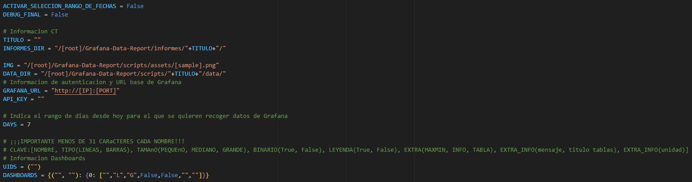
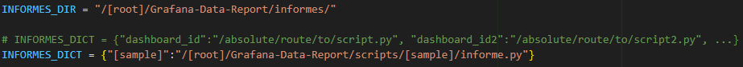

# **Grafana-Data-Report**
> [!NOTE]
> Actualmente solo esta disponible para sistemas operativos **Linux**. No se asegura el correcto funcionamiento en Windows o MacOS.

## **Descripción**

Proyecto con una serie de scripts que permiten realizar informes en formato excel recogiendo datos directemente desde la API de Grafana y en un rango de fechas personalizable.

Todos los gráficos y la información que aparece en el informe tiene un grado alto de personalización gracias a una serie de parámetros configurables.

## **Requerimientos**

```
apt install python3
apt install python3-pip
apt-get install python3-tk
pip3 install -r requirements.tx
```

## **Ejecución del script**
> [!IMPORTANT]  
> Para asegurar el funcionamiento correcto se recomienda solamente modificar los archivos *config.py*. Se recomienda en todo momento usar rutas absolutas para asegurar el correcto funcionamiento del script.

Puedes clonar la carpeta *sample* y cambiarle el nombre las veces que quieras según el número de informes que se deseen realizar.

### Config.py

Para configurar y personalizar los informes se debe modificar el archivo [*config.py*](scripts/sample/config.py) dentro de la carpeta.

- **ACTIVAR_SELECCION_RANGO_DE_FECHAS**: Al estar en true cuando se ejecute el script manualmente se podrá seleccionar en una ventana el rango de fechas para los datos del informe.

- **DEBUG_FINAL**: Al estar en true se mostraran mensajes de debug en la consola.

- **IMG**: ruta a la imagen que se quiera usar para el informe. En caso de que no se quiera usar imagen se debe dejar vacío (“”).

- **DATA_DIR**: directorio donde se quieran crear los archivos de los datos recogidos en crudo. Se recomienda que se cree en la misma carpeta del script para evitar errores al tener mas informes diferentes.

- **GRAFANA_URL**: url del grafana que se quiera usar. Se debe indicar IP (o domino si quiere usar https) y puerto.

- **API_KEY**: clave API para poder establecer la conexión con la - API de Grafana.

- **DAYS**: Indica el rango de días desde hoy para el que se quieren recoger datos de Grafana.

- **TITULO**: nombre que se quiera dar al informe.

- **INFORMES_DIR**: directorio que va a contener los excel que se generen con el script.

- **UIDS**: corresponden a los ids de los dashboards donde se realizarán las consultas, debe están en el orden en que se desea que aparezcan en el informe. Estos se pueden encontrar fácilmente en la URL del navegador cuando te encuentras dentro de un dashboard.


- **DASHBOARDS**:  contiene la información de los dashboards y sus paneles de donde 
se recogerán los datos para mostrar en el informe. Deben estar en orden y concordar con el 
orden de los UIDS. Las claves del diccionario son un array con el título del dashboard y el texto 
que se quiere mostrar en su separador del Excel. El valor del diccionario es otro diccionario 
donde la clave es el id del panel correspondiente de donde se sacará información, y el valor es 
un array de 7 posiciones donde cada posición corresponde a una característica o opción de la 
información que saldrá de ese panel en el informe.
Las opciones son:
    1. **Título** del panel.
    2. **Tipo** de gráfico. (**“L”** = Gráfico de líneas // **“B”** = Gráfico de barras)
    3. **Tamaño** del gráfico. **“P”** = Pequeño // **“M”** = Mediano // **“G”** = Grande
    4. Indica si los datos recogidos son **binarios** (0, 1) o no. **“True”** // **“False”**
    5. Indica si se desea que en el gráfico aparezca la **leyenda** o no. **“True”** // **“False”**
    6. Indica si se desea **información extra** de los datos recogidos y si es así que tipo de información. **“”** = Sin información extra // **“INFO”** = Añade el texto deseado si no se ha recogido ningún dato // **“MAXMIN”** = Muestra los valores máximos y mínimos de la primera serie recogida del panel // **“TABLE”** = Muestra una tabla con los valores máximos y mínimos de todas las series recogidas del panel.
    7. **Texto adicional** que se muestra de una forma u otra dependiendo de la opción escogida en la posición 6.


### Ejecución

Primero debes asegurarte de estar en la carpeta correcta:
```
cd /[root]/Grafana-Data-Report/scripts/sample/
```

Hay que asegurarse que todos los scripts que vayas a ejecutar tengan los permisos adecuados:
```
chmod +x informe.py
```

> [!WARNING]
> Se recomienda formatear el archivo para asegurar que se ejecuta correctamente:
> ```
> apt install dos2unix
> dos2unix informe.py
> ```

Ahora podemos ejecutar el archivo desde consola:
```
./informe.py
```

> [!TIP]
> Podemos automatizar la ejecución del script para que se ejecute periódicamente:
> ```
> crontab -e
> ```
> Añade una línea al final del archivo que tenga esta forma:
> ```
> 0 0 * * 0 /usr/bin/python3 /[root]/Grafana-Data-Report/scripts/sample/informe.py
> ```
> Esto automatiza la ejecución para que se ejecute a las 0 horas, 0 minutos, * cualquier día del mes, * cualquier mes, 0 domingo (0-6 representa domingo a sábado).

## **Configuración de la API**

Primero se debe configurar el archivo *config_flask.py* dentro de la carpeta *scripts*, puedes copiar la configuración de [*config_flask_sample.py*](scripts/config_flask_sample.py) y adaptarlo a tus necesidades.



- **INFORMES_DIR**: al igual que en el archivo config del script aquí se debe especificar la ruta donde se generan los scripts. Es recomendable que todos los informes diferentes que tengas apunten a la misma ruta para poder llegar a todos desde la API.

- **INFORMES_DICT**: diccionario donde la clave es el nombre o id para identificar el script y indicarlo cuando se haga la petición, mientras que el valor es la ruta al script correspondiente.

> [!CAUTION]
> Aquí es crucial que las rutas sean absolutas desde el root ('/') de tu máquina.

Luego instalamos las herramientas:
```
apt update
pip3 install flask
apt install nginx
```

Crea un archivo de servicio systemd:
```
nano /etc/systemd/system/flask_server.service
```
Dentro debes escribir algo como:
```
[Unit]
Description=Servidor Flask para ejecutar script
After=network.target
[Service]
User=root
WorkingDirectory=/[root]/Grafana-Data-Report/scripts
ExecStart=/usr/bin/python3 /[root]/Grafana-Data-Report/scripts/flaskserver.py
Restart=always
RestartSec=10
Environment="PORT=5000"
[Install]
WantedBy=multi-user.target
```

Ahora debemos habilitar e iniciar el servicio:
```
systemctl daemon-reload
systemctl start flask_server.service
systemctl enable flask_server.service
systemctl status flask_server.service
```

Crea un archivo de configuración:
```
nano /etc/nginx/sites-available/flask_proxy
```
Y rellenalo con las siguientes líneas:
```
server {
    location /grafana-data-report {
        proxy_pass http://localhost:5000;
        proxy_set_header Host $host;
        proxy_set_header X-Real-IP $remote_addr;
        proxy_set_header X-Forwarded-For $proxy_add_x_forwarded_for;
        proxy_set_header X-Forwarded-Proto $scheme;
    }
 }
```

Finalmente reinicia el servicio para que se apliquen los cambios:
```
systemctl restart nginx
```

Ahora puedes ejecutar el script haciendo una petición HTTP de la forma:
```
http://[IP]:5000/grafana-data-report/[id]
```
Donde *IP* es la direcciónd de la máquina donde has configurado la API y *id* es la **clave** asignada al script *informe.py* en la constante **INFORMES_DICT** dentro de *config_flask.py*.

Esto devuelve el informe en formato excel. Si lo ejecutas desde el navegador o desde un botón de grafana que haga la petición el archivo se descargará directamente en tu dispositivo.
